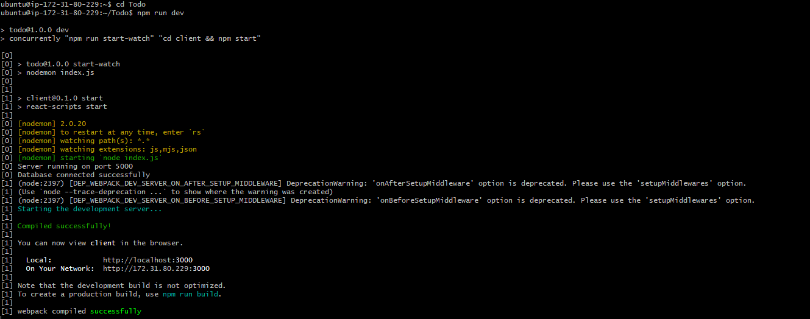

# SIMPLE TO-DO APPLICATION ON MERN WEB STACK

In this project, you are tasked to implement a web solution based on MERN stack in AWS Cloud.
MERN web stack consists of following components:
1. MongoDB
2. ExpressJS: 
3. ReactJS
4. Node.js

Any interaction that causes a data change request is sent to the NodeJS based Express server, which grabs data from the MongoDB database if required, and returns the data to the frontend of the application, which is then presented to the user.

## result i got while doing project 3
 
 
  
 
 
 
 
 
  
 
 
 
 
 
 
 
 
 

